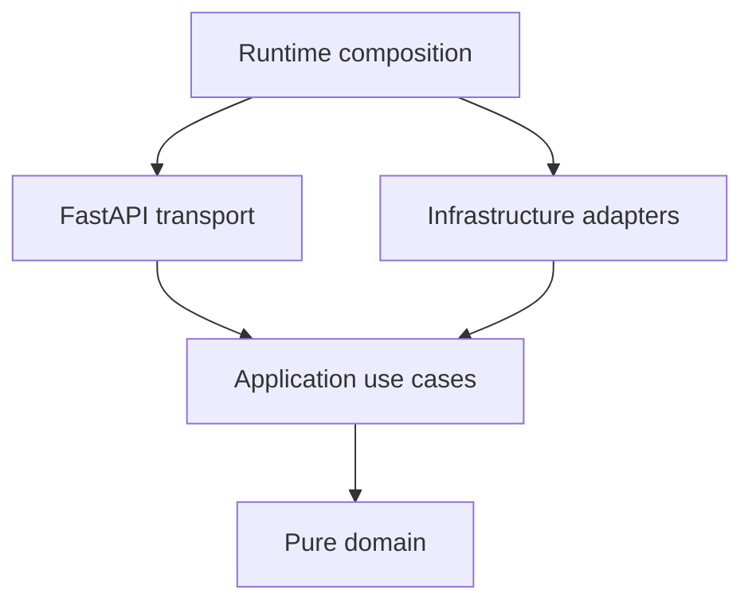
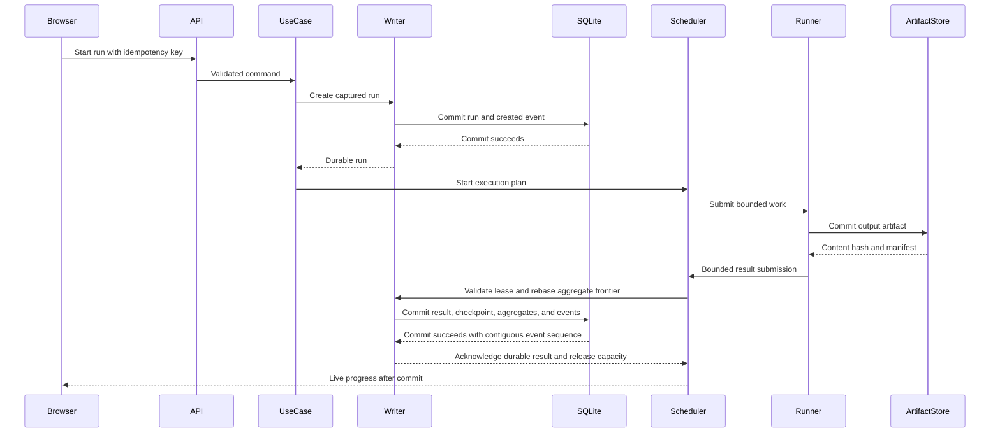

# Architecture

## Architectural goals

ParityGrid must be understandable from the HTTP boundary through application services, domain decisions, durable persistence, analytical reconciliation, and browser state. Each module must have one primary reason to change.

The architecture optimizes for:

- Deterministic logical results.
- Explicit transaction and recovery boundaries.
- Replaceable infrastructure adapters.
- Testable pure domain rules.
- Bounded use of threads, tasks, processes, memory, and disk.
- A zero-service local demonstration.
- Clear extension points for new connectors and runners.

## Dependency rule



Dependencies point inward. The domain package must not import FastAPI, SQLAlchemy, DuckDB, HTTPX, filesystem APIs, environment configuration, or logging frameworks.

## Target package map

```text
src/paritygrid/
├── domain/
│   ├── models/
│   ├── pipeline/
│   ├── execution/
│   ├── reconciliation/
│   ├── repair/
│   ├── canonical/
│   └── errors.py
├── application/
│   ├── commands/
│   ├── queries/
│   ├── services/
│   ├── execution/
│   ├── planner/
│   └── ports/
├── adapters/
│   ├── persistence/
│   ├── analytics/
│   ├── artifacts/
│   ├── connectors/
│   ├── runners/
│   │   └── process_workers/
│   └── telemetry/
├── api/
│   ├── routers/
│   ├── schemas/
│   ├── dependencies/
│   ├── errors/
│   ├── middleware/
│   └── app.py
├── runtime/
│   ├── config.py
│   ├── lifecycle.py
│   ├── composition.py
│   └── capabilities.py
├── demo/
│   ├── scenarios.py
│   ├── simulators/
│   └── verification.py
└── cli.py
```

## Layer responsibilities

### Domain

The domain defines:

- Validated identifiers and values.
- Pipeline and execution-plan semantics.
- Run and work-item state machines.
- Reconciliation classifications.
- Repair-plan rules.
- Canonical serialization and fingerprints.
- Typed failures.

Domain functions should be pure wherever practical. Domain time and identifiers must be passed explicitly.

### Application

The application layer coordinates use cases:

- Create and publish a pipeline version.
- Create, pause, resume, cancel, and recover a run.
- Compile an execution plan.
- Schedule dependency-ready partition work through selected runner mechanics.
- Commit work results and checkpoints.
- Generate, approve, and apply repair plans.
- Query reconciliation and comparison views.

It depends only on domain objects and typed ports.

### Adapters

Adapters implement ports for:

- SQLite persistence.
- DuckDB analytical queries.
- Filesystem and Parquet artifacts.
- HTTP and file connectors.
- Thread, task, queue, and subordinate process-pool mechanics.
- Telemetry publication.

Adapter-specific exceptions must be translated into typed application failures before crossing inward.

### API

The API owns:

- Request and response schemas.
- Authentication for local control actions if enabled.
- HTTP status mapping.
- Problem Details errors.
- Request correlation.
- Idempotency headers.
- SSE durable event replay.
- WebSocket ephemeral telemetry.
- Static frontend delivery.

The API must not contain reconciliation or execution decisions.

### Runtime

Runtime composition owns:

- Configuration loading and validation.
- Capability detection.
- Database and analytics initialization.
- Connection and client lifecycles.
- Runner registration.
- Application startup and shutdown.
- Loopback binding policy.

Runtime is the only package allowed to instantiate the full dependency graph.

## Execution ownership

The application execution package owns runner-neutral policy:

- DAG readiness and node dependency barriers.
- Work admission, leasing, retries, pause generations, cancellation, and recovery.
- Capacity and rate policy, bounded result flow, and the transactional-result boundary.
- Versioned work assignments, results, lifecycle states, and recovery frontiers.
- Sequential execution as the semantic reference.

The scheduled and capacity-counted unit is one `(run_id, node_id, partition_key)` work item. Nodes are dependency barriers, not runner submissions. Attempts are immutable executions of a work-item identity. Connector calls are subordinate operations that consume connector permits; they are not independently leased work. A successor node becomes ready only after every predecessor work item is durably terminal with an allowed aggregate outcome. Phase 7 does not stream records across an unfinished dependency edge.

Runner adapters own mechanics only. Threaded and asyncio adapters execute application-admitted work but do not decide DAG readiness, persist authoritative state, or publish durable progress. Process execution is a subordinate pool for registered connector-free CPU operations, not a full-plan runner. The parent process owns leases, artifact coordination, result validation, and SQLite writes. `src/paritygrid/adapters/runners/process_workers/` is the process isolation boundary; its transitive imports exclude persistence, runtime composition, connectors, and database libraries. Interpreter pools are optional and obey the same subordinate-worker boundary.

Runtime captures immutable settings and capability facts before a run starts, registers only supported strategies, and owns their startup and shutdown. Capability detection reports structured unavailability; it does not silently substitute a different strategy.

## Typed ports

At minimum, define protocols for:

- `PipelineRepository`
- `ConnectorRepository`
- `RunRepository`
- `CheckpointRepository`
- `ExecutionEventRepository`
- `IdempotencyRepository`
- `RepairRepository`
- `AuditRepository`
- `ArtifactStore`
- `AnalyticsEngine`
- `ExecutionRunner`
- `ExecutionResultCoordinator`
- `Connector`
- `ResultSink`
- `TelemetryPublisher`
- `Clock`
- `IdentifierFactory`

Ports must express domain-level operations rather than exposing ORM sessions, SQL strings, HTTP clients, or raw file handles.

## End-to-end command flow



No work result is acknowledged as durable, releases a dependency, or publishes authoritative progress until its checkpoint and durable events commit successfully. An unknown writer outcome stops new admission and places the run in recovery-required state.

## Read model

Operational reads come from SQLite repositories. Analytical reads come from DuckDB views over committed Parquet artifacts and stable SQLite metadata snapshots.

Every run response includes a monotonic run version. Collections derived from multiple queries must identify their run version and reconciliation fingerprint. The frontend must not combine incompatible versions into one visible snapshot.

## Event model

Two event channels serve different guarantees:

### Durable execution events

- Stored append-only in SQLite.
- Sequenced per run.
- Used for recovery, audit, and SSE replay.
- Published to subscribers only after commit.

### Ephemeral telemetry

- Sent through WebSockets.
- Includes queue depths, worker utilization, and transient timing.
- May be sampled or lost on disconnect.
- Must never be required to reconstruct authoritative state.

## Configuration

Configuration is validated once at startup and passed as immutable settings. It must cover:

- Bind address and port.
- Data and artifact roots.
- Database filename.
- SQLite timeouts and writer queue capacity.
- Artifact size limits.
- Default runner limits.
- Per-strategy capabilities and lifecycle limits.
- Per-connector capacity and validated rate policy.
- Bounded assignment, result, telemetry, and SQLite writer capacities.
- Connector allowlists.
- Telemetry settings.
- Demo seed and failure profile.

Secrets are referenced by environment-variable name. Connector definitions must never persist secret values.

## Runtime profiles

### Demo

- Isolated generated data directory.
- Local synthetic source systems.
- SQLite and DuckDB embedded files.
- Production frontend served by FastAPI.
- Deterministic scenario and failure script.

### Development

- Vite development server proxies API traffic.
- FastAPI runs separately.
- Data root is explicitly configured.
- Source simulators may run independently.

### Test

- Temporary file-based databases.
- Deterministic clock and identifiers.
- Dynamic loopback ports.
- Scripted failpoints.
- No reliance on developer machine state.

### Packaged

- Committed `web/dist` assets.
- One Python command starts the application.
- Node.js is not a runtime dependency.

## Extensibility rules

### New connector

A connector must provide typed configuration, capability metadata, cancellation, size enforcement, structured errors, and the shared connector conformance suite.

### New runner

A full-plan strategy must implement the versioned application contract and pass the common scheduling, lifecycle, recovery, cleanup, resource-bound, and execution-evidence suites. A subordinate process or interpreter pool instead passes the registered CPU-operation, wire-envelope, isolation, cancellation, and cleanup suites and must not be advertised as a full-plan strategy.

### New pipeline node

A node must declare typed ports, deterministic configuration serialization, resource requirements, validation, executor compatibility, and tests. Nodes may not execute arbitrary user code.

## Architecture enforcement

CI must fail when:

- The domain imports an outer layer.
- API routes directly import ORM models.
- Adapters bypass application ports.
- Worker code opens an uncoordinated SQLite write path.
- `adapters/runners/process_workers` imports persistence, runtime composition, connectors, or database libraries directly or transitively.
- DuckDB state becomes authoritative.
- A public contract changes without a matching contract update and tests.
