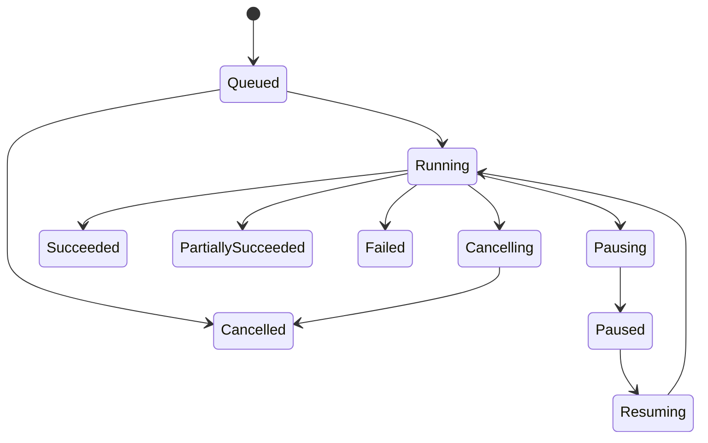

# Execution model

## Objective

The execution engine must demonstrate different Python concurrency strategies without changing logical outcomes. Sequential execution is the semantic reference. Threaded and asynchronous execution must pass the same conformance suite and produce the same canonical result.

## Pipeline node registry

The initial registry contains:

- Async HTTP source.
- Blocking HTTP source.
- CSV source.
- JSON Lines source.
- Normalize records.
- Validate records.
- Partition records.
- Reconcile with target.
- Generate repair plan.
- Approval gate.
- Apply simulated repairs.
- Verify target state.
- Export Parquet.

Each node definition must declare:

- Stable node-kind identifier.
- Versioned configuration schema.
- Typed input and output ports.
- Supported runners.
- Resource and concurrency requirements.
- Retry behavior.
- Whether effects require idempotency.
- Deterministic configuration encoding.
- Validation and conformance tests.

Arbitrary executable code nodes are prohibited.

## Planning

Before publication, a pipeline must pass:

- Unique identifier validation.
- Directed acyclic graph validation.
- Reachability validation.
- Port compatibility validation.
- Connector existence and capability validation.
- Required configuration validation.
- Resource-limit validation.
- Approval-before-repair validation.
- Canonical-format compatibility validation.

The planner produces an immutable execution plan and plan fingerprint. JSON key ordering or visual node positions must not change the logical plan fingerprint.

## Work decomposition

A work item is uniquely identified by:

```text
(run_id, node_id, partition_key)
```

Work items are created from the captured execution plan. An attempt is a separate immutable record. A retry reuses the work-item identity and increments the attempt number.

## Run lifecycle



Invalid transitions must fail as typed domain errors. Terminal states cannot return to an active state.

## Work-item lifecycle

```text
pending -> leased -> running -> succeeded
                     |  |
                     |  +-> retry_wait -> leased
                     +----> quarantined
                     +----> failed
                     +----> cancelled
```

Leases allow recovery to distinguish unfinished work from committed work. Lease expiry never authorizes duplicate external effects without an idempotency check.

## Runner contract

Every runner must:

1. Accept an immutable execution plan and bounded runtime limits.
2. Start only work whose dependencies are satisfied.
3. Emit normalized attempt events.
4. Observe cancellation promptly.
5. Return results through the configured result sink.
6. Release all resources during shutdown.
7. Never publish authoritative state directly.

### Sequential runner

- Runs one work item at a time.
- Provides the correctness baseline.
- Uses the same connector, result, checkpoint, and event boundaries as other runners.

### Threaded runner

- Uses a bounded `ThreadPoolExecutor`.
- Targets blocking HTTP and file operations.
- Applies per-connector capacity limits.
- Never shares a database session between threads.
- Must detect or structurally prevent nested pool deadlocks.

### Async runner

- Uses structured task groups.
- Uses asynchronous HTTP clients and explicit timeouts.
- Uses bounded queues and per-source semaphores.
- Propagates cancellation rather than swallowing it.
- Closes clients and streams on cancellation.

### Process runner

- Targets CPU-heavy canonicalization, validation, or hashing.
- Receives immutable serializable inputs.
- Returns serializable results through IPC.
- Does not open a SQLite write path.
- Is optional for the minimum demo but required before the first full release if advertised.

### Interpreter runner

- Is experimental and capability-detected.
- Must report why it is unavailable.
- Must never be required for the default demo or core correctness gate.
- Must pass the runner conformance suite before being exposed in the UI.

## Bounded resources

The runtime must configure limits for:

- Concurrent work items.
- Per-connector requests.
- Thread workers.
- Process workers.
- In-flight records.
- Result queue capacity.
- SQLite writer queue capacity.
- HTTP response bytes.
- File bytes.
- Artifact bytes per run.

No queue may default to unbounded growth.

## Backpressure

Backpressure must propagate from:

- Artifact writing to normalization.
- Persistence to worker result production.
- Reconciliation to upstream partition creation.
- Connector limits to source scheduling.

The UI displays queue depth, wait duration, and active capacity. Slower persistence must reduce producer throughput rather than consume unbounded memory.

## Retry classification

| Failure | Default action |
|---|---|
| Connection failure | Bounded retry |
| Timeout | Bounded retry |
| HTTP 429 | Retry after validated delay |
| HTTP 5xx | Bounded retry |
| HTTP 4xx | Permanent unless explicitly classified |
| Validation failure | Quarantine |
| Idempotency conflict | Terminal conflict |
| SQLite contention | Short bounded persistence retry |
| User cancellation | Do not retry |

Retries use exponential backoff with bounded jitter. The canonical demo uses a seeded jitter source for reproducibility.

## Checkpoint commit rule

For each completed partition:

1. Produce and commit its output artifact.
2. Send result metadata to the transactional writer.
3. Commit attempt result, work state, checkpoint, and durable events atomically.
4. Acknowledge completion to the scheduler.
5. Make the committed event visible to clients.

If the process stops before step 3, recovery may repeat the partition. Idempotent artifact identity and effect keys prevent duplicate logical effects. If step 3 succeeds, recovery must not repeat the committed effect.

## Pause, cancellation, and recovery

- Pause stops admitting new work and reaches a stable checkpoint boundary.
- Cancellation signals active work, stops new scheduling, and waits for bounded cleanup.
- Forced termination is recovered from durable state at the next startup.
- Recovery scans expired leases, committed checkpoints, idempotency records, and artifact integrity.
- Recovery must report ambiguity rather than guessing after an integrity failure.

## Runner equivalence

For identical scenario, pipeline, inputs, and supported settings, required runners must produce:

- The same accepted record set.
- The same quarantined record set.
- The same reconciliation classifications.
- The same repair plan contents.
- The same applied target effects.
- The same final canonical fingerprint.

Timing, attempt order, and completion order may differ.

## Execution QA

Required evidence includes:

- Common runner conformance tests.
- Fifty or more shuffled repeated executions in stress verification.
- Cancellation under saturation.
- Pause and resume at every checkpoint boundary.
- Forced termination before and after commit points.
- Thread, task, process, queue, memory, and file-descriptor bounds.
- Retry and quarantine classification tests.
- Final fingerprint equivalence across required runners.
